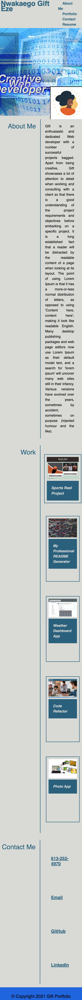

# My-Portfolio
A portfolio of work that showcases my skills and talents as a fullstack Web developer in a more practical and visual way to employers. 

## Description
This is a website that is more than just a description of skills, but a place that demonstrates what I am capable of as a full stack Web developer. A way to proof the skills and talents mentioned in my resume and other professional profiles such as LinkedIn.

## Why was this project built
Apart from being a requirement coursework for the Full Stack Web Developmenty program, this portfolio was developed as the avenue to showcase the technical and practical deliverables of a web developer. 
For the first lap of this project, the HTML/CSS skills was put to practice and exhibited. A look at the website shows the incorporation of HTML/CSS consepts like responsive webpages, navigation menus, the various make  up of the body of the web page, use of flexbox and other aesthetics. In addition the creative side of a web developer is also represented in the use of colors, and the entire look of the web page.

## Links to deployed application

* URL of deployed application: https://e-giftz.github.io/My-Portfolio/

* URL of Github repository containing code:  https://github.com/e-giftz/My-Portfolio

## Screenshots of Webpage 

### Phone Resolution Screen

```md

```

### Ipad Resolution

```md

```

### Resolution 1920X1020

```md

```

### Full Screen

```md

```


